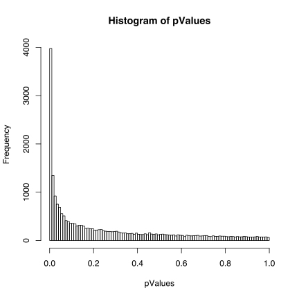
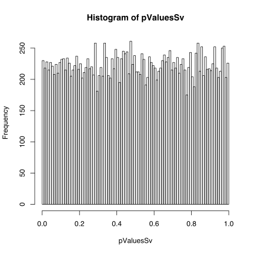
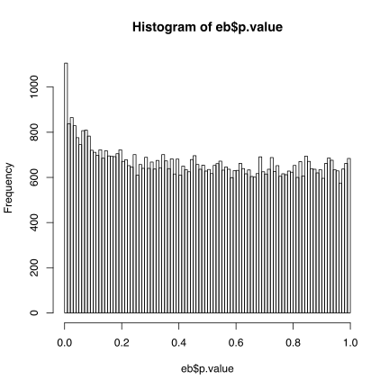
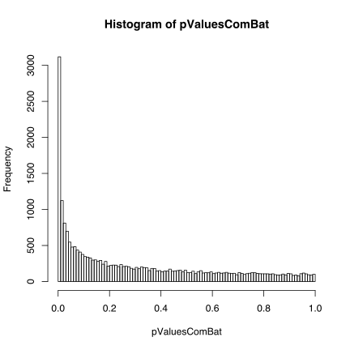
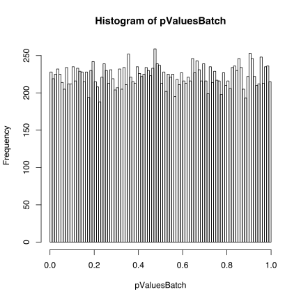

Sanity check for ComBat in the SVA tutorial.
========================================================


2014-06-05 16:39:46

## Overview
This small report aim to show that the application of ComBat as described in the [user guide](http://www.bioconductor.org/packages/2.13/bioc/vignettes/sva/inst/doc/sva.pdf) accompanying the R package [sva](http://www.bioconductor.org/packages/2.13/bioc/html/sva.html) presented in [Leek et al.](http://bioinformatics.oxfordjournals.org/cgi/pmidlookup?view=long&pmid=22257669) will lead to false results even for random data.

One sanity checks will be performed
- Swapping real data with random numbers including a batch effect.

The rest of the tutorial will be performed with a few extra plots of the p-value distributions from the different analyses.

Most code are taken directly from the vignette source 'vignettes/sva/inst/doc/sva.Rnw'. For more explanation, please read the [sva tutorial](http://www.bioconductor.org/packages/2.13/bioc/vignettes/sva/inst/doc/sva.pdf) in parallel while remembering that the real data is swapped with random numbers.


```r

options(width = 65)

library(sva)
```

```
## Loading required package: corpcor
## Loading required package: mgcv
## Loading required package: nlme
## This is mgcv 1.7-29. For overview type 'help("mgcv-package")'.
```

```r
library(bladderbatch)
```

```
## Loading required package: Biobase
## Loading required package: BiocGenerics
## Loading required package: parallel
## 
## Attaching package: 'BiocGenerics'
## 
## The following objects are masked from 'package:parallel':
## 
##     clusterApply, clusterApplyLB, clusterCall,
##     clusterEvalQ, clusterExport, clusterMap, parApply,
##     parCapply, parLapply, parLapplyLB, parRapply,
##     parSapply, parSapplyLB
## 
## The following object is masked from 'package:stats':
## 
##     xtabs
## 
## The following objects are masked from 'package:base':
## 
##     anyDuplicated, append, as.data.frame, as.vector,
##     cbind, colnames, duplicated, eval, evalq, Filter,
##     Find, get, intersect, is.unsorted, lapply, Map,
##     mapply, match, mget, order, paste, pmax, pmax.int,
##     pmin, pmin.int, Position, rank, rbind, Reduce,
##     rep.int, rownames, sapply, setdiff, sort, table,
##     tapply, union, unique, unlist
## 
## Welcome to Bioconductor
## 
##     Vignettes contain introductory material; view with
##     'browseVignettes()'. To cite Bioconductor, see
##     'citation("Biobase")', and for packages
##     'citation("pkgname")'.
```

```r
data(bladderdata)
library(pamr)
```

```
## Loading required package: cluster
## Loading required package: survival
## Loading required package: splines
```

```r
library(limma)
```

```
## 
## Attaching package: 'limma'
## 
## The following object is masked from 'package:BiocGenerics':
## 
##     plotMA
```

```r

pheno = pData(bladderEset)

edata = exprs(bladderEset)
```


In this sanity check the real data is replaced with random numbers. A batch effect is also added since sva needs a batch effect or it will report "No significant surrogate variables". This is a simple and not necessarily the most realistic way of adding a batch effect.

```r
set.seed(100)
edata[,] = rnorm(length(edata))
for(batch in (unique(pheno$batch)))
{
	for(s in 1:dim(edata)[1])
	{
		thisgenesbatcheffect = rnorm(1)
		a= pheno$batch==batch
		edata[s, a] = edata[s, a] + thisgenesbatcheffect
	}
}
```


The first example shows the p-values when batch is ignored.

```r

mod = model.matrix(~as.factor(cancer), data = pheno)

mod0 = model.matrix(~1, data = pheno)

n.sv = num.sv(edata, mod, method = "leek")
n.sv
```

```
## [1] 4
```

```r

svobj = sva(edata, mod, mod0, n.sv = n.sv)
```

```
## Number of significant surrogate variables is:  4 
## Iteration (out of 5 ):1  2  3  4  5
```

```r

pValues = f.pvalue(edata, mod, mod0)
qValues = p.adjust(pValues, method = "BH")
hist(pValues, breaks = 100)
```

 

The above plot is from p-values calculated when batch is ignored, i.e the included batch effect acts a confounder.


```r

modSv = cbind(mod, svobj$sv)
mod0Sv = cbind(mod0, svobj$sv)

pValuesSv = f.pvalue(edata, modSv, mod0Sv)
qValuesSv = p.adjust(pValuesSv, method = "BH")
hist(pValuesSv, breaks = 100)
```

 

This is the p-values when batch is handled by the sva method. The plot makes sense for random numbers.


```r

fit = lmFit(edata, modSv)

contrast.matrix <- cbind(C1 = c(-1, 1, 0, rep(0, svobj$n.sv)), C2 = c(0, 
    -1, 1, rep(0, svobj$n.sv)), C3 = c(-1, 0, 1, rep(0, svobj$n.sv)))
fitContrasts = contrasts.fit(fit, contrast.matrix)

eb = eBayes(fitContrasts)
topTableF(eb, adjust = "BH")
```

```
##                  C1      C2      C3 AveExpr      F   P.Value
## 203364_s_at  5.1153  0.1077  5.2230 -0.8042 11.942 6.509e-06
## 216870_x_at -4.8305 -0.9741 -5.8046  0.7818 11.556 9.581e-06
## 222325_at   -4.7635  0.2507 -4.5128  0.9714 10.658 2.351e-05
## 213516_at    0.1753  2.5854  2.7608 -0.1643 10.352 3.193e-05
## 219398_at    4.6206  0.7864  5.4070 -0.9919 10.273 3.455e-05
## 208886_at    2.7417 -1.8828  0.8590 -0.6630  9.638 6.519e-05
## 207767_s_at  4.3599  0.8882  5.2481 -1.6645  9.433 8.001e-05
## 220781_at   -4.4184 -0.6382 -5.0567  1.6032  9.214 9.966e-05
## 218131_s_at  4.3580 -0.3900  3.9680 -0.7385  9.167 1.044e-04
## 213168_at   -1.8091  2.1369  0.3278 -0.1052  9.111 1.104e-04
##             adj.P.Val
## 203364_s_at    0.1067
## 216870_x_at    0.1067
## 222325_at      0.1540
## 213516_at      0.1540
## 219398_at      0.1540
## 208886_at      0.2421
## 207767_s_at    0.2460
## 220781_at      0.2460
## 218131_s_at    0.2460
## 213168_at      0.2460
```

```r
hist(eb$p.value, breaks = 100)
```

 

This is the p-values when limma is used in conjunction with the sva-method. There is a slight skewness, but not much.


Next comes the ComBat method of adjusting for batch, where the batch effect is estimated while trying to retain the group differences. The data is adjusted and in the next step a differential expression analysis is performed.

```r

batch = pheno$batch

mod = model.matrix(~as.factor(cancer), data = pheno)

combat_edata = ComBat(dat = edata, batch = batch, mod = mod, numCovs = NULL, 
    par.prior = TRUE, prior.plots = FALSE)
```

```
## Found 5 batches
## Found 2  categorical covariate(s)
## Standardizing Data across genes
## Fitting L/S model and finding priors
## Finding parametric adjustments
## Adjusting the Data
```

```r

pValuesComBat = f.pvalue(combat_edata, mod, mod0)
qValuesComBat = p.adjust(pValuesComBat, method = "BH")
hist(pValuesComBat, breaks = 100)
```

 

The p-values from the analysis when ComBat adjusted data is used shows a rather huge skewness, and a lot of genes would falsely been reported as differentially  expressed.

The next example is described as a simplified version of ComBat.

```r

modBatch = model.matrix(~as.factor(cancer) + as.factor(batch), data = pheno)
mod0Batch = model.matrix(~as.factor(batch), data = pheno)
pValuesBatch = f.pvalue(edata, modBatch, mod0Batch)
qValuesBatch = p.adjust(pValuesBatch, method = "BH")
hist(pValuesBatch, breaks = 100)
```

 

The above method of handling batch is quite similar to the blocking method described in the [limma guide](http://www.bioconductor.org/packages/release/bioc/vignettes/limma/inst/doc/usersguide.pdf). The resulting p-values are as expected for random data.


The last example from the sva tutorial is how to use sva in a prediction analysis. This might not be relevant, but is included.

```r

n.sv = num.sv(edata, mod, vfilter = 2000, method = "leek")
svobj = sva(edata, mod, mod0, n.sv = n.sv, vfilter = 2000)
```

```
## Number of significant surrogate variables is:  3 
## Iteration (out of 5 ):1  2  3  4  5
```

```r

set.seed(12354)
trainIndicator = sample(1:57, size = 30, replace = F)
testIndicator = (1:57)[-trainIndicator]

trainData = edata[, trainIndicator]
testData = edata[, testIndicator]

trainPheno = pheno[trainIndicator, ]
testPheno = pheno[testIndicator, ]

mydata = list(x = trainData, y = trainPheno$cancer)
mytrain = pamr.train(mydata)
```

```
## 123456789101112131415161718192021222324252627282930
```

```r
table(pamr.predict(mytrain, testData, threshold = 2), testPheno$cancer)
```

```
##         
##          Biopsy Cancer Normal
##   Biopsy      1      0      0
##   Cancer      2     19      3
##   Normal      0      0      2
```


```r

trainMod = model.matrix(~cancer, data = trainPheno)
trainMod0 = model.matrix(~1, data = trainPheno)
trainSv = sva(trainData, trainMod, trainMod0)
```

```
## Number of significant surrogate variables is:  3 
## Iteration (out of 5 ):1  2  3  4  5
```

```r

fsvaobj = fsva(trainData, trainMod, trainSv, testData)
mydataSv = list(x = fsvaobj$db, y = trainPheno$cancer)
mytrainSv = pamr.train(mydataSv)
```

```
## 123456789101112131415161718192021222324252627282930
```

```r
table(pamr.predict(mytrainSv, fsvaobj$new, threshold = 1), testPheno$cancer)
```

```
##         
##          Biopsy Cancer Normal
##   Biopsy      1      0      0
##   Cancer      2     19      3
##   Normal      0      0      2
```

The prediction does not improve when sva is used to adjust for batch. This makes sense since it is random data.


### References


Johnson, WE, Rabinovic, A, and Li, C (2007). Adjusting batch effects in microarray expression data using Empirical Bayes methods. Biostatistics 8(1):118-127.

Storey, J. D. and Tibshirani, R. (2003) Proc Natl Acad Sci U S A, 100, 9440-5.

Leek JT, Johnson WE, Parker HS, Jaffe AE, Storey JD.(2012) The sva package for removing batch effects and other unwanted variation in high-throughput experiments. Bioinformatics. 2012 Mar 15;28(6):882-3.
http://bioinformatics.oxfordjournals.org/cgi/pmidlookup?view=long&pmid=22257669

Smyth, GK (2005). Limma: linear models for microarray data. In: 'Bioinformatics and Computational Biology Solutions
  using R and Bioconductor'. R. Gentleman, V. Carey, S. Dudoit, R. Irizarry, W. Huber (eds), Springer, New York, pages
  397-420.
  
  R Core Team (2013). R: A language and environment for statistical computing. R Foundation for Statistical Computing,
  Vienna, Austria. URL http://www.R-project.org/

  Yihui Xie (2013). knitr: A general-purpose package for dynamic report generation in R. R package version 1.5.

  Yihui Xie (2013) Dynamic Documents with R and knitr. Chapman and Hall/CRC. ISBN 978-1482203530

  Yihui Xie (2013) knitr: A Comprehensive Tool for Reproducible Research in R. In Victoria Stodden, Friedrich Leisch and
  Roger D. Peng, editors, Implementing Reproducible Computational Research. Chapman and Hall/CRC. ISBN 978-1466561595
  
  RStudio Team (2012). RStudio: Integrated Development for R. RStudio, Inc., Boston, MA URL http://www.rstudio.com/.


```r
sessionInfo()
```

```
R version 3.0.2 (2013-09-25)
Platform: x86_64-apple-darwin10.8.0 (64-bit)

locale:
[1] en_US.UTF-8/en_US.UTF-8/en_US.UTF-8/C/en_US.UTF-8/en_US.UTF-8

attached base packages:
[1] splines   parallel  stats     graphics  grDevices utils    
[7] datasets  methods   base     

other attached packages:
 [1] limma_3.18.13      pamr_1.54.1        survival_2.37-7   
 [4] cluster_1.15.2     bladderbatch_1.0.7 Biobase_2.22.0    
 [7] BiocGenerics_0.8.0 sva_3.8.0          mgcv_1.7-29       
[10] nlme_3.1-117       corpcor_1.6.6      knitr_1.5         

loaded via a namespace (and not attached):
[1] evaluate_0.5.5  formatR_0.10    grid_3.0.2     
[4] lattice_0.20-29 Matrix_1.1-3    stringr_0.6.2  
[7] tools_3.0.2    
```


generation ended 2014-06-05 16:40:22. Time spent 1 minutes .
